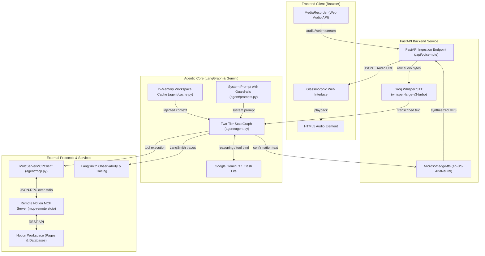
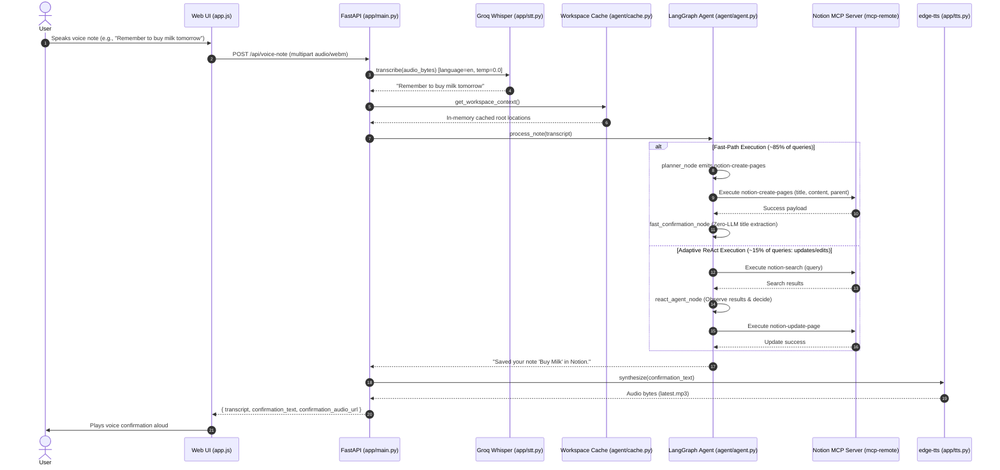
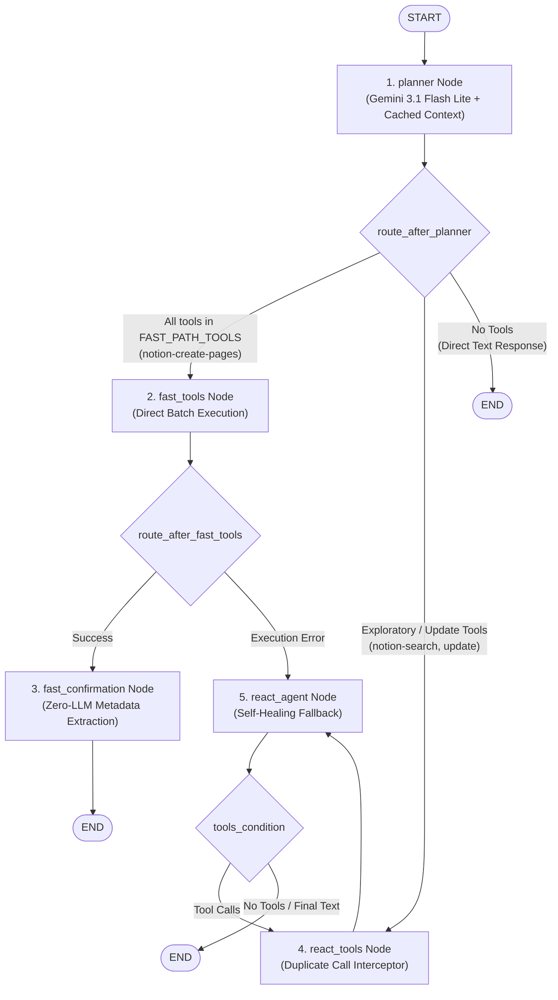

# NoteFlow System Architecture

**NoteFlow** is a high-speed, voice-first autonomous agentic pipeline designed to capture spoken thoughts, format them into structured Markdown, and file them directly into Notion via the **Model Context Protocol (MCP)** with sub-4-second response times.

---

## 1. High-Level System Architecture

The following diagram illustrates the complete end-to-end architecture from voice ingestion to Notion filing and spoken feedback:



---

## 2. End-to-End Pipeline & Sequence Flow



---

## 3. Two-Tier LangGraph State Machine

NoteFlow implements a specialized **Two-Tier State Machine** in [`agent/agent.py`](file:///d:/Agentic_AI/NoteFlow_Simple/agent/agent.py) that separates predictable one-shot note captures from complex multi-turn updates:



### Node Responsibilities:

| Node | Purpose | Fallback / Output |
|---|---|---|
| **`planner`** | Ingests user transcript and pre-cached workspace structure. Formulates entire formatted payload on turn 1. | If no tools emitted, concludes immediately. |
| **`fast_tools`** | Directly executes one-shot page creation tools (`notion-create-pages`) in Notion without intermediate LLM hops. | If any tool execution fails, drops into `react_agent` for self-healing. |
| **`fast_confirmation`** | Generates instant spoken confirmation from tool metadata (**Zero-LLM overhead**). | Outputs clean audio confirmation string. |
| **`react_tools`** | Executes exploratory tools with a runtime **Idempotent Duplicate Interceptor**. | Traps identical tool calls with cached feedback. |
| **`react_agent`** | Multi-turn reasoning agent for targeted page updates, block edits, and error recovery. | Concludes when tool calls are exhausted. |

---

## 4. Key Engineering Innovations & Reliability Guardrails

### A. Plan-Once Single-Shot Page Creation
* **Problem**: Standard ReAct agents follow a chatty pattern: *search $\to$ create empty page $\to$ append blocks $\to$ format $\to$ confirm*, taking 8–15 seconds across 3–4 round-trips.
* **Solution**: The system prompt instructs Gemini to emit complete nested Markdown bodies (headings, bullet points, checklists) directly into the `content` property of `notion-create-pages` in Turn 1.
* **Impact**: Eliminates redundant block-append round-trips and cuts capture latency by over 70%.

### B. In-Memory Workspace Context Pre-Caching ([`agent/cache.py`](file:///d:/Agentic_AI/NoteFlow_Simple/agent/cache.py))
* **Problem**: `notion-search` on remote MCP requires non-empty keywords and adds 1.5s latency per search.
* **Solution**: Background cache fetches workspace root pages using `notion-list-private-pages` and `notion-list-shared-pages` with a 10-minute TTL (`_TTL = 600`).
* **Impact**: Parent page IDs are injected directly into the system prompt, enabling single-turn targeting without search.

### C. Zero-LLM Fast Confirmation Node
* **Problem**: In a standard agent, once a tool finishes executing, the graph cycles back to the LLM just to generate: *"Saved your note in Notion."* This wastes 1.0–1.5 seconds.
* **Solution**: `fast_confirmation_node` extracts the note title directly from the creation tool arguments (`_extract_title_from_args`) and produces the confirmation sentence in 0 milliseconds.
* **Impact**: Total LLM generation calls for standard notes are capped at **exactly 1**.

### D. Idempotent Duplicate Tool Call Interceptor ([`agent/agent.py`](file:///d:/Agentic_AI/NoteFlow_Simple/agent/agent.py#L131-L197))
* **Problem**: When speech recognition misinterprets a page name, the LLM enters an attractor loop, calling `notion-search` with the exact same query 9+ times.
* **Solution**: `react_tools_node` tracks `(tool_name, canonical_json_args)` signatures in the message history. If a duplicate is detected, it is intercepted immediately with feedback instructing the model to pivot.
* **Impact**: Completely eliminates infinite search loops while preserving full multi-search capabilities for legitimate multi-page tasks.

### E. Recursion Circuit Breaker
* **Problem**: Runaway agent iterations can exhaust API quotas and freeze the server.
* **Solution**: `process_note` enforces `config={"recursion_limit": 8}` and wraps execution in a graceful fallback handler:
  ```python
  try:
      result = await agent.ainvoke(..., config={"recursion_limit": 8})
  except Exception:
      return "Sorry, I got stuck trying to save that note. Please try again."
  ```

### F. Speech-to-Text (STT) Hardening ([`app/stt.py`](file:///d:/Agentic_AI/NoteFlow_Simple/app/stt.py))
* **Problem**: Groq Whisper Large v3 Turbo hallucinates or flips to foreign languages (Welsh, Polish, Urdu) during silence, noise, or accents.
* **Solution**:
  1. `language="en"`: Disables automatic language detection.
  2. `temperature=0.0`: Enforces deterministic decoding.
  3. `prompt=STT_PROMPT_HINT`: Primes the model with Notion and productivity vocabulary (*NoteFlow, Notion, notes, tasks, pages, database, to-do list, journal, meeting notes*).

---

## 5. Latency & Performance Breakdown

| Pipeline Stage | Legacy ReAct Pipeline | NoteFlow Two-Tier Pipeline | Improvement |
|---|---|---|---|
| **Speech-to-Text (STT)** | ~0.8s (unconstrained) | ~0.4s (deterministic Whisper Turbo) | **2x faster** |
| **Workspace Discovery** | 1.5s (`notion-search` call) | 0.0s (in-memory TTL cache) | **Zero latency** |
| **Reasoning & Planning** | ~1.5s per turn (3–4 turns) | ~1.0s (single-turn planner) | **3x faster** |
| **Tool Execution** | 2–3 MCP calls (~3.0s) | 1 composite MCP call (~1.2s) | **2.5x faster** |
| **Confirmation Generation** | ~1.2s (extra LLM round-trip) | 0.0s (`fast_confirmation` node) | **Zero latency** |
| **Audio Synthesis (TTS)** | ~0.5s (`edge-tts`) | ~0.5s (`edge-tts`) | Identical |
| **Total End-to-End Latency** | **8.0 – 15.0 seconds** | **~2.8 – 3.5 seconds** | **~4x overall speedup** |

---

## 6. Directory Structure & File Map

```
NoteFlow_Simple/
├── architecture.md        # Comprehensive system architecture documentation
├── README.md              # Project overview and quickstart guide
├── pyproject.toml         # Dependencies and project metadata
├── uv.lock                # Pinned dependency lockfile
├── .env.example           # Template for environment configuration
│
├── agent/                 # Agent Reasoning, StateGraph & MCP Tools
│   ├── __init__.py        # Exports build_agent, process_note
│   ├── agent.py           # Two-Tier StateGraph, fast-path & duplicate interceptor
│   ├── cache.py           # In-memory TTL cache for Notion workspace root pages
│   ├── mcp.py             # Notion Remote MCP client (mcp-remote stdio transport)
│   └── prompts.py         # System prompt with fast-path and honesty guardrails
│
└── app/                   # Backend Application & Web UI
    ├── main.py            # FastAPI service, static file mounting & API routes
    ├── config.py          # Pydantic Settings & environment variable validation
    ├── stt.py             # Groq Whisper Large v3 Turbo transcription engine
    ├── tts.py             # Microsoft edge-tts speech synthesis service
    └── static/            # Frontend Assets
        ├── index.html     # Web UI with voice recording & text fallback
        ├── style.css      # Dark glassmorphic interface styling
        └── app.js         # MediaRecorder handling, REST requests & audio playback
```
